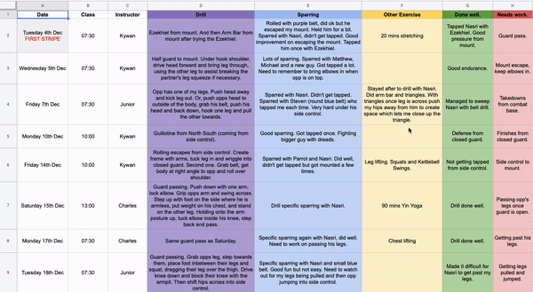

<div align="center">


### [live preview](https://classnotesv2.herokuapp.com/users/sign_in)

</div>

## Table of Contents
- [Motivation](#Motivation)
- [Preview](#Preview)
- [Features](#Features)
- [Install](#Install)
- [Stack](#Stack)
  * [Project](#Project)
  * [Testing](#Testing)
  * [Gems](#Gems)

## Motivation

One of my hobbies is Brazilian Jiu Jitsu, a martial art which depends on the accumilation of knowledge and skill. A problem, however, is how to keep track of all this knowledge. Previously I used a Google sheet to keep notes, but I thought there was a better way.

<br>
<div align="center">



</div>
<br>

Enter **_Classnotes_**: a simple, lightweight journal to accompany learning. The idea is that after class you can write down what you learned, tag it, and then build a repository of techniques and ideas that can be quickly accessed.

## Preview 


<p>&nbsp;</p>


## Features


- [x] Tagging for notes.
- [x] Sorting notes by tag; this allows the user to filter by technique and position.
- [x] Seperate fields for technique and sparring.
- [x] Responsive design; app can be used on mobile or desktop.
- [ ] Sharing notes between _friends_.
- [ ] Sorting by class and instructor.

<br>
<br>
<br>
<br>
<br>
<br>

## Install
Clone the repository
``` bash
% git clone https://github.com/arthurfincham/REPO_NAME
```
Go to the project directory and install dependencies:
```bash
% cd REPO_NAME
```
``` bash
% bundle install
 ```
#### Set up [PostgreSQL](https://www.postgresql.org/download/) if not already installed.

Create databases
```bash
% rails db:create
```
Migrate tables
```bash
% rails db:migrate
```
Run the server
```bash
% bundle exec rails server
```


## Stack

### Project

|                 | Tool                                      | Use?                                       | Where can I see it?                                             |
| :-------------: | ----------------------------------------- | ------------------------------------------ | --------------------------------------------------------------- |
|       | [PostgreSQL](https://www.postgresql.org)  | Object-relation database.                  | ```/db/migrations/*``` In the SQL commands below.               |
|   | [Ruby on Rails](https://rubyonrails.org/) | Server-side web framework written in Ruby. | Everywhere!                                                     |
|     | [Bootstrap](https://getbootstrap.com/)    | Open source tool-kit made by twitter.      | In the basic design structure of tables and navigation.         |
|     | [Heroku](https://www.heroku.com/)    | Cloud platform for deploying web apps.      | Hosting the live preview.         |

### Testing

|             | Tool                                                 | Use?                                | Where can I see it?                                 |
| :---------: | ---------------------------------------------------- | ----------------------------------- | :-------------------------------------------------- |
|   | [RSpec](https://rspec.info/)                         | Testing tool for Ruby.              | ```/spec/*``` Unit tests for the app's classes.     |
|      | [Capybara](https://github.com/teamcapybara/capybara) | Acceptance test framework for Ruby. | ```/spec/features/*``` Feature testing for the app. |


### Gems

|       | Gem                                                                | Use?                                                                   |
| :---: | ------------------------------------------------------------------ | ---------------------------------------------------------------------- |
| :gem: | [shoulda-matchers](https://github.com/thoughtbot/shoulda-matchers) | Extends the matchers of Rspec.                                         |
| :gem: | [devise](https://github.com/heartcombo/devise)                     | Flexible authentication solution for Rails.                            |
| :gem: | [awesome_print](https://github.com/awesome-print/awesome_print)    | One of my favourite gems; pretty prints output from the Rails console. |